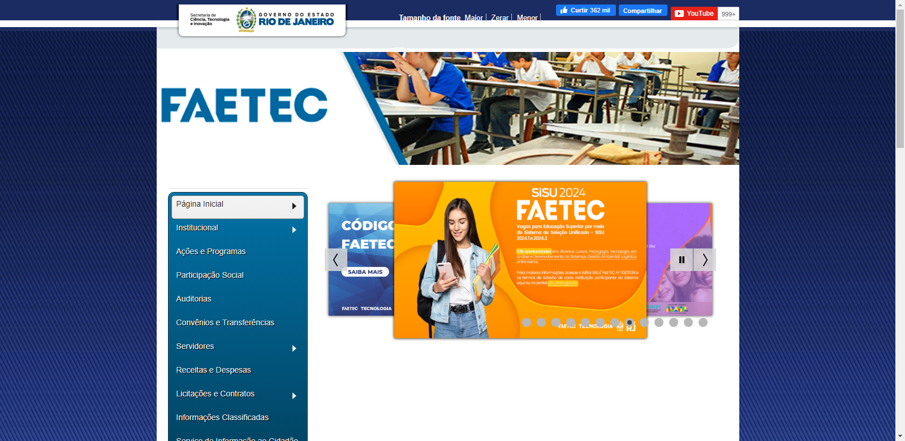
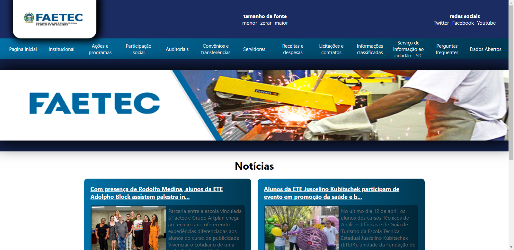

# FAETEC - Remake da homepage

## Descrição
Uma recriação da página inicial da FAETEC (http://www.faetec.rj.gov.br/) que criei utilizando o React. Tentei criar uma interface mais agradável ao usuário já que a original me incomodava muito.

# Imagens das versões

## - Site original da Faetec (http://www.faetec.rj.gov.br/)

## - Site recriado com React

# Observações

Eu não adicionei todas as funcionalidades do site original pois o meu objetivo era só recriar o site com um "template" mais agradável.

Todas as imagens, informações e conteúdo do site pertencem à Faetec e o governo, novamente dizendo, o que eu fiz foi recriar o site com um template mais agradável (pelo menos pra mim :P).
